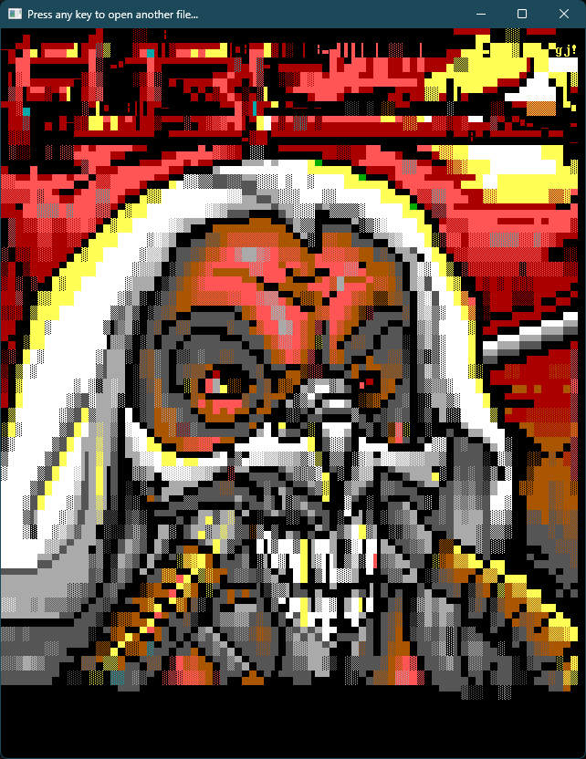
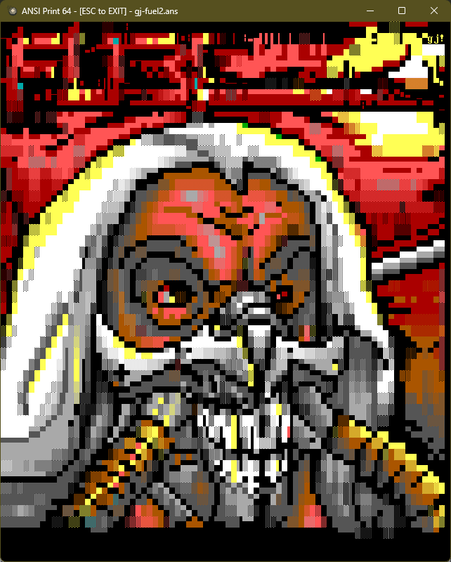
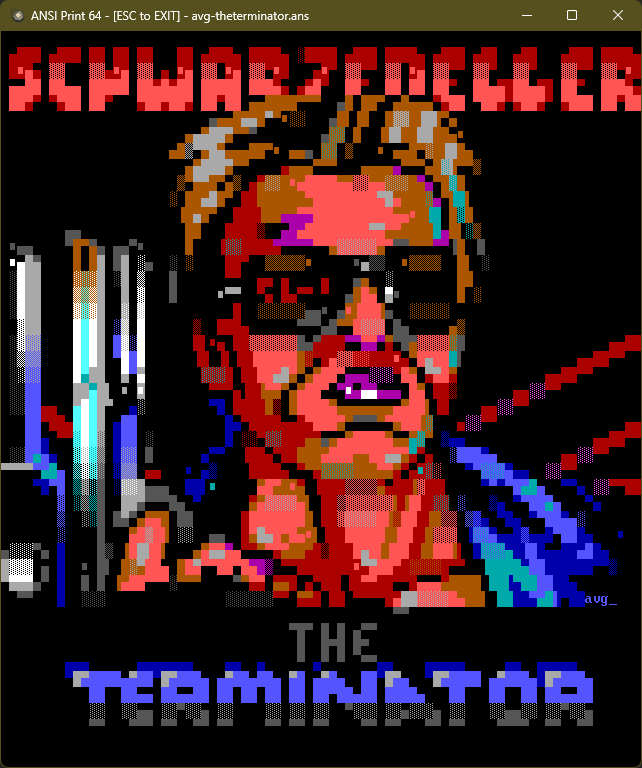
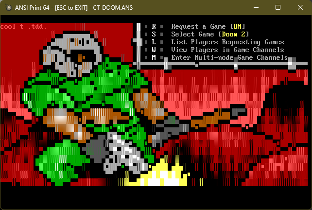

# ANSI ESCAPE SEQUENCE EMULATOR

This is an [ANSI Escape Sequence](https://en.wikipedia.org/wiki/ANSI_escape_code) Emulator library written entirely in [QB64-PE](https://github.com/QB64-Phoenix-Edition/QB64pe).






## FEATURES

- No dependency on third party libraries
- Works on Windows, Linux & macOS
- Works in 32bpp graphics mode emulating text mode colors and true color extensions
- Supports most common ANSI escape sequences and even some obscure ones
  - All meaninful [ANSI Escape Sequences](https://en.wikipedia.org/wiki/ANSI_escape_code)
  - All meaninful [ANSI.SYS Escape Sequences](https://en.wikipedia.org/wiki/ANSI.SYS)
  - [PabloDraw](https://github.com/cwensley/pablodraw) 24bpp color escape sequence
- Supports embedded [ANSI music](docs/ansimtech.txt) - WIP
- Supports [ANSImation](http://www.roysac.com/ansianim.html) content
- Support querying width and height of the content in characters - WIP
- Easy plug-&-play API - OK
- Loads and renders [ANS](https://en.wikipedia.org/wiki/ANSI_art), ASC, DIZ, NFO and TXT files
- Includes a demo viewer to show how to use the library

## USAGE

- Clone the repository to a directory of your choice
- Open Terminal and change to the directory using an appropriate OS command
- Run `git submodule update --init --recursive` to initialize, fetch and checkout git submodules
- Open *ANSIPrint64.bas* in the QB64-PE IDE and press `F5` to compile and run
- To use the library in your project add the [Toolbox64](https://github.com/a740g/Toolbox64) repositiory as a [Git submodule](https://git-scm.com/book/en/v2/Git-Tools-Submodules)

## API

```VB
' Easy top-level API (call and forget style)
Sub PrintANSI (sANSI As String)

' Core library functions (if more control is required)
Sub InitializeANSIEmulator
Sub ResetANSIEmulator
Sub SetANSIEmulationSpeed (nCPS As Long)
Function PrintANSICharacter& (ch As Unsigned Byte)
Function PrintANSIString& (s As String)

' Library support functions
Sub SetANSICanvasColor (c As Unsigned Long, isBackground As Long, isLegacy As Long)
Function GetANSICanvasWidth&
Function GetANSICanvasHeight&
Sub ClearANSICanvasArea (l As Long, t As Long, r As Long, b As Long)
```

## FAQ

What can I do with this?

- Anything you want! Use it in games, demos or for writing pretty text mode user interfaces and output.

Can you implment feature x / y?

- With the limited time I have between my day job, home and family, there is only so much I can do. I do maintain a list of TODO (see below). However, those do not have any set deadlines. If you need something implemented, submit a GitHub issue about it or do it yourself and submit a PR.

I found a bug. How can I help?

- Let me know using GitHub issues or fix it yourself and submit a PR!

Can this be used in a game / demo?

- Absolutely. The demo code included in a good example.

## NOTES

- This requires the latest version of [QB64-PE](https://github.com/QB64-Phoenix-Edition/QB64pe)
- The renderer is designed for QB64's 32BPP graphics Window. Legacy `SCREEN`s will not work
- This is WIP. So, expect things to change and break. There are some bugs and quirks that needs to be worked out
- When you clone a repository that contains submodules, the submodules are not automatically cloned by default
- You will need to use the `git submodule update --init --recursive` to initialize, fetch and checkout git submodules

## BIBLIOGRAPHY

- [ANSI Escape Sequences](https://gist.github.com/fnky/458719343aabd01cfb17a3a4f7296797) by Christian Petersen
- [ANSI escape code](https://en.wikipedia.org/wiki/ANSI_escape_code) from Wikipedia
- [ANSI.SYS](https://en.wikipedia.org/wiki/ANSI.SYS) from Wikipedia
- [Console Virtual Terminal Sequences](https://learn.microsoft.com/en-us/windows/console/console-virtual-terminal-sequences) by Microsoft
- [ANSI.SYS Documentation](https://learn.microsoft.com/en-us/previous-versions/tn-archive/cc722862(v=technet.10)) by Microsoft
- [ANSI.SYS Documentation and Reference](http://www.roysac.com/learn/ansisys.html) by Carsten Cumbrowski
- [ANSIPLUS Escape Sequences](http://www.sweger.com/ansiplus/EscSeq.html) by Kristofer Sweger
- [NANSI.SYS Documentation](docs/nansi.txt) by Daniel Kegel
- [NNANSI.COM Documentation](docs/nnansi.txt) by Tom Almy
- [ANSI Color Codes](https://talyian.github.io/ansicolors/) by Jimmy Tang
- [SAUCE – Standard Architecture for Universal Comment Extensions](https://www.acid.org/info/sauce/sauce.htm) by Olivier "Tasmaniac" Reubens / ACiD
- [ANSI Music](docs/ansimtech.txt) by unknown
- Various resources and information from <https://16colo.rs/>, <http://www.roysac.com/> and <https://int10h.org/>

## ASSETS

[Icon](https://www.iconarchive.com/artist/designcontest.html) by DesignContest

## CREDITS

[Rick Christy (grymmjack)](https://github.com/grymmjack) for pointing out issues and helping me with invaluable resources. This project includes some of his [artwork](https://16colo.rs/artist/grymmjack) for testing. Thanks Rick!
