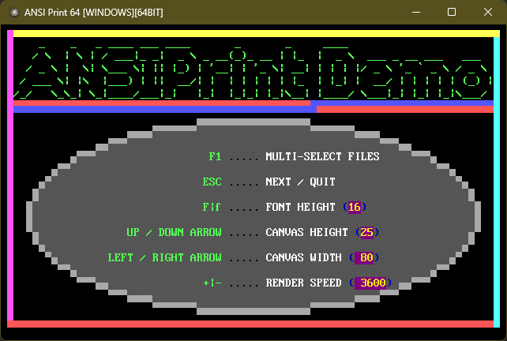

# QB64 ANSI ESCAPE SEQUENCE EMULATOR

This is an [ANSI Escape Sequence](https://en.wikipedia.org/wiki/ANSI_escape_code) Emulator library written entirely in [QB64-PE](https://github.com/QB64-Phoenix-Edition/QB64pe).




## Goals

- No dependency on third party libraries - OK
- No OS specific code - OK
- Support all meaninful [ANSI Escape Sequences](https://en.wikipedia.org/wiki/ANSI_escape_code) - OK
- Support all meaninful [ANSI.SYS Escape Sequences](https://en.wikipedia.org/wiki/ANSI.SYS) - OK
- Support all meaninful non-ANSI escape sequences (e.g. [PabloDraw](https://github.com/cwensley/pablodraw) 24bpp colors) - OK
- Support embedded [ANSI music](docs/ansimtech.txt) - WIP
- Support [animated ANSI](http://www.roysac.com/ansianim.html) content - OK
- Support querying width and height of the content in characters - WIP
- Easy plug-&-play API - OK
- Load and render all [ANS](https://en.wikipedia.org/wiki/ANSI_art), ASC, DIZ, NFO and TXT files in the repository correctly - WIP
- Include a demo viewer to show how to use the library - OK

## API

```VB
' Easy top-level API (call and forget style)
Sub PrintANSI (sANSI As String)

' Core library functions (if more control is required)
Sub InitializeANSIEmulator
Sub ResetANSIEmulator
Sub SetANSIEmulationSpeed (nCPS As Long)
Function PrintANSICharacter& (ch As Unsigned Byte)
Sub PrintANSIString (s As String)

' Library support functions
Sub SetANSICanvasColor (c As Unsigned Long, isBackground As Long, isLegacy As Long)
Function GetANSICanvasWidth&
Function GetANSICanvasHeight&
Sub ClearANSICanvasArea (l As Long, t As Long, r As Long, b As Long)
```

## Bibliography

- [ANSI Escape Sequences](https://gist.github.com/fnky/458719343aabd01cfb17a3a4f7296797) by Christian Petersen
- [ANSI escape code](https://en.wikipedia.org/wiki/ANSI_escape_code) from Wikipedia
- [ANSI.SYS](https://en.wikipedia.org/wiki/ANSI.SYS) from Wikipedia
- [Console Virtual Terminal Sequences](https://learn.microsoft.com/en-us/windows/console/console-virtual-terminal-sequences) by Microsoft
- [ANSI.SYS Documentation](https://learn.microsoft.com/en-us/previous-versions/tn-archive/cc722862(v=technet.10)) by Microsoft
- [ANSI.SYS Documentation and Reference](http://www.roysac.com/learn/ansisys.html) by Carsten Cumbrowski
- [ANSIPLUS Escape Sequences](http://www.sweger.com/ansiplus/EscSeq.html) by Kristofer Sweger
- [NANSI.SYS Documentation](docs/nansi.txt) by Daniel Kegel
- [NNANSI.COM Documentation](docs/nnansi.txt) by Tom Almy
- [ANSI Color Codes](https://talyian.github.io/ansicolors/) by Jimmy Tang
- [SAUCE – Standard Architecture for Universal Comment Extensions](https://www.acid.org/info/sauce/sauce.htm) by Olivier "Tasmaniac" Reubens / ACiD
- [ANSI Music](docs/ansimtech.txt) by unknown
- Various resources and information from <https://16colo.rs/>, <http://www.roysac.com/> and <https://int10h.org/>

## What can I do with this?

Anything you want! Use it in games, demos or for writing pretty text mode user interfaces and output.

## Notes

- This requires the latest version of [QB64-PE](https://github.com/QB64-Phoenix-Edition/QB64pe)
- The renderer is designed for QB64's 32BPP graphics Window. Legacy `SCREEN`s will not work
- This is WIP. So, expect things to change and break. There are some bugs and quirks that needs to be worked out

## Credits

[Rick Christy (grymmjack)](https://github.com/grymmjack) for pointing out issues and helping me with invaluable resources. I've also used some of his artwork shamelessly for testing my library. 😁
